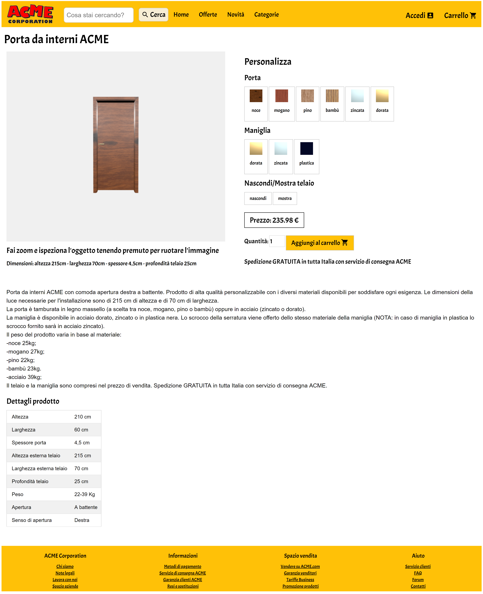

# Report

- Maurizio Favaro (matricola 120099)
- favaro.maurizio@spes.uniud.it

PROGETTO IN FASE DI SVILUPPO

## Descrizione

 

 Il risultato finale di questo progetto è una rappresentazione di un'ipotetica pagina web del sito di e-commerce della ACME Corporation nella quale viene esposto un prodotto in vendita. Il prodotto in questione è una porta da interni, disponibile in diversi materiali. L'oggetto viene visualizzato tramite un modello 3d che può essere personalizzato dall'utente tramite gli appositi pulsanti: un potenziale cliente è in grado quindi di capire come si presenterebbe la porta scegliendo tra le varie opzioni a disposizione.

## File e cartelle

* **`Assignment`**: contiene i file con la consegna forniti per questo progetto.
* **`lib`**: contiene le librerie necessarie al funzionamento del progetto.
* **`model`**: contiene il file del modello 3d della porta.
  * `Door_Component_BI3.obj`: modello 3d della porta realizzato da [3dhaupt](https://free3d.com/it/user/3dhaupt), trovato su [free3d.com](https://free3d.com/it/3d-model/room-door-94798.html).
* **`pics`**: contiene le immagini inserite in questo file e nel `journal.md`.
* **`scripts`**: contiene i file Javascript per la visualizzazione del prodotto e la gestione della pagina web.
  * `getMaterials.js`: file che contiene le funzioni per la gestione dei materiali.
  * `lightsSetup.js`: file che contiene il setup delle luci.
  * `main.js`: file che contiene le funzioni principali per il caricamento e la visualizzazione della porta.
  * `materialMetal.js`: file che contiene le funzioni per la generazione di materiali metallici.
  * `materialTexture.js`: file che contiene le funzioni per la generazione di materiali da texture.
  * `priceCalculator.js`: file che contiene le funzioni per il calcolo dinamico del prezzo del prodotto.
* **`textures`**: contiene le textures dei materiali di porta e maniglia.
  * `bamboo[_col|_rgh|_spc].jpg`: componente diffusiva, di roughness e speculare della texture del bambù da [freepbr.com](https://freepbr.com/materials/bamboo-wood-pbr-material/).
  * `Mahogany[_col|_rgh|_spc].jpg`: componente diffusiva, di roughness e speculare della texture del mogano da [3dtextures.me](https://3dtextures.me/2018/12/27/wood-009-mahogany/).
  * `Plastic[_col|_rgh|_spc].jpg`: componente diffusiva, di roughness e speculare della texture della plastica da [3dtextures.me](https://3dtextures.me/2018/03/26/plastic-001-w-speckles-and-fingerprints/).
  * `Wood_011[_col|_rgh|_spc].jpg`: componente diffusiva, di roughness e speculare della texture del pino da [3dtextures.me](https://3dtextures.me/2019/01/10/wood-011a/).
  * `Wood29[_col|_rgh|_spc].jpg`: componente diffusiva, di roughness e speculare della texture del noce da [cc0textures.com](https://www.cc0textures.com/view.php?tex=Wood29).
* `index.html`: file principale che contiene il codice della pagina web. Contiene anche gli shader.
* `journal.md`: file che contiene il processo di sviluppo del progetto: qui vengono segnalati i progressi giornalieri e le scelte effettuate.
* `README.md`: questo file.

## Risultati

- TODO
